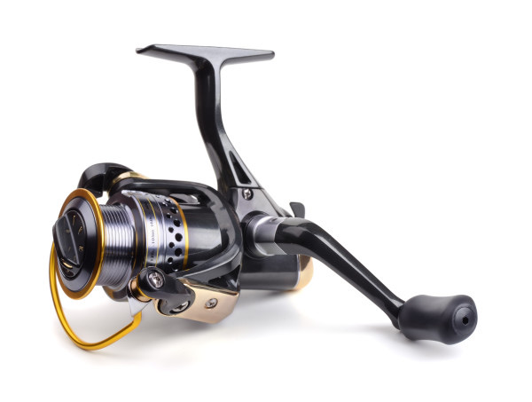
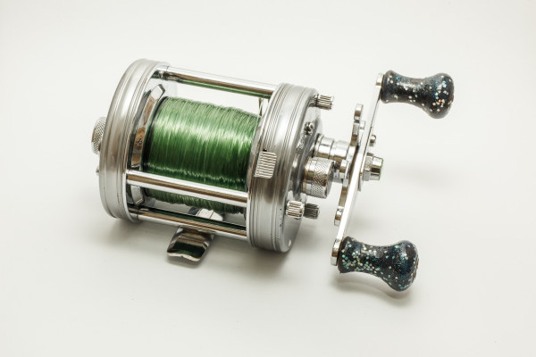
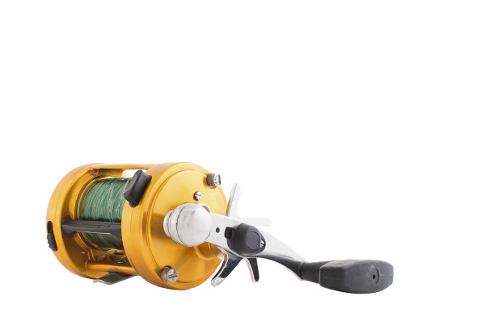

# Fundamental Reels
In the world of saltwater fishing, rods and reels make up the basic tools of the trade. Matching the correct reel to the right rod can be a daunting task, however, so let’s take a look at the fundamental choices available to you as you set out to learn more about this amazing sport.
---
::There are four main factors that affect a reel’s performance:::
1)  the body of the reel, in particular what it’s made of...
2) the gear train of the reel 
3) The reel’s drag; and 
4) The entire bearing system.
---
::**Spinning Reels**::

The spinning reel was developed after the Second World War and is by far the most popular design on the market today. Primarily a casting reel, spinners offer ease of use, simplicity and durable construction and make fishing easy for most people.
Spinners come in sizes ranging from tiny reels designed for tiny fish and ultra-light line, to massive designs with stout drag systems built to tame the largest fish in the sea.
They come with corresponding price tags too. You don’t have to pay a lot to get a quality spinning reel capable of catching quality fish, but if you want the best, most high-tech reels to tackle giants, very expensive models exist for that.
---
**Bait-Casting Reels
**
Bait-casters were what everyone used for casting purposes before the development of spinning gear, and some people still prefer the simplicity of the bait-caster design. These are smaller revolving-spool reels, meant for casting, and they often feature a level-wind mechanism. 
Spinning reels retrieve line through the aforementioned bail roller, which necessitates a 90-degree turn as the line goes onto the reel. This can twist the line as it goes onto the spool, causing problems. __Fans of bait-casters point this out as an inherent design flaw with spinners, and tout the direct retrieval of line onto a bait-caster’s spool as a superior method.__
This is true, but bait-casters tend to be harder to cast, being subject to backlash tangles known as “bird nests” as the spool spins too fast during the cast. Many bait-casters have magnets built into the reel to adjust the speed of the spool and help prevent backlashes, but in the end, the type of casting reel you choose comes down to personal preference. 
> *Buying a bait-caster reel tips.*
> [https://www.youtube.com/watch?v=qsRc_7T9D2g](https://www.youtube.com/watch?v=qsRc_7T9D2g)
> ::* DO NOT buy Graphite frames; regardless number of bearing that they have. 
> ::::* DO NOT buy combos. ::
> ::* 6,7,8 bearing on an aluminum frame real::
---
**Conventional Reels**

::These revolving-spool designs are made primarily for trolling, but can also be used for deep-jigging and bottom fishing. ::Conventional reels vary greatly in size, price and construction. The top models are built on machined aluminum or titanium frames and have sophisticated drags for catching huge fish, but once again, models exist for all circumstances and budgets.
__Conventional reels come with one of two basic drag adjustment styles; lever drags or star drags. 
__* The star drag is an older design, which utilizes a wheel on the side of the reel resembling a star. Turning the wheel loosens or tightens the drag, depending on which way you turn it.
* Lever drags are much more prevalent and use a lever to adjust the drag from zero (known as “free-spool”) to the point where the reel is locked up. Most reels feature a detent in the range of adjustment known as the “strike” position, and that’s where you set the drag tension for fighting a fish. 

